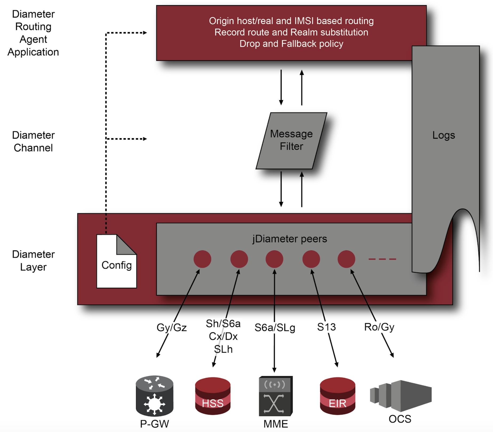
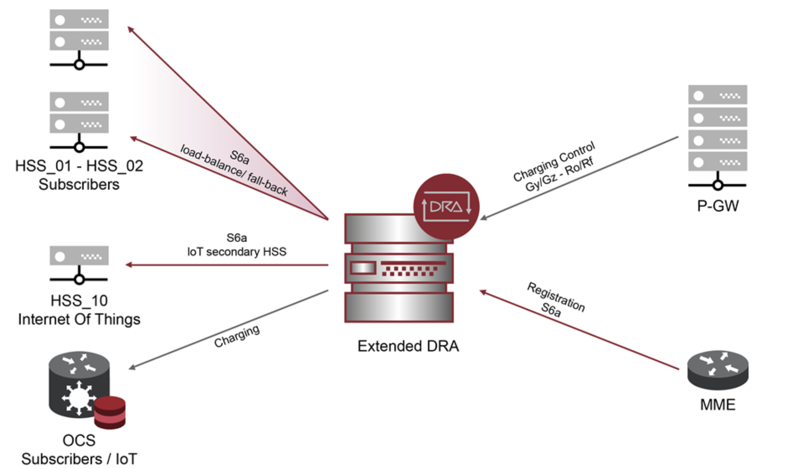

# Extended Diameter Routing Agent

A standalone Diameter Routing Agent. It sits in the middle of a Diameter core
network, matches every incoming request against a set of operator-defined rules
and forwards it to the appropriate destination peer, applying priority, weighted
load distribution, fall-back and drop policies along the way.

Routing is driven by a single XML file that is watched at run time, so rules,
destinations and weights can be changed without restarting the node or dropping
a Diameter association. Matching goes beyond origin and destination identity:
the agent discriminates traffic by subscriber identity — IMSI or MSISDN read
from the message itself — which makes it usable as a subscriber-partitioning
front end for HSS, PCRF, OCS and Cellular IoT platforms.

Built on the Diameter Base Protocol as defined in IETF RFC 6733 and on the 3GPP
reference points derived from it. It runs as a plain Java process: no
application server and no container runtime are required.



## Capabilities

- Rule-based routing with regular-expression matching on origin host and realm,
  destination host and realm, and Application-Id.
- Subscriber discrimination by IMSI, read either from the 3GPP-IMSI AVP or from
  the Subscription-Id grouped AVP, and by MSISDN, resolved in cascade from
  Public-Identity, MSISDN and User-Identity.
- Priority routing and weighted load distribution across destination hosts.
- Fall-back policy on network and protocol failures, realm-based fall-back, and
  a drop policy for requests that cannot be delivered.
- Origin and Destination AVP replacement, with Route-Record preservation for
  loop detection.
- Dynamic realm learning, persisted in PostgreSQL and reloaded at start-up.
- Runtime peer administration through a management CLI, without restart.

The complete reference for every configuration attribute is in
[RELEASE_NOTES.md](RELEASE_NOTES.md).



## Modules

| Module | Description |
|---|---|
| `extended-diameter-routing-agent` | The routing agent. Main class `com.paic.esg.impl.DiameterRoutingAgent`. |
| `management` | The `dra-cli` management client. Main class `com.paic.esg.management.DRACommandLine`. |
| `release` | Ant build that assembles the distribution archive. |

## Requirements

- Java 11
- Apache Maven 3.6.3 or later, and Apache Ant 1.10 or later to assemble the
  distribution
- PostgreSQL, for realm persistence
- Linux, with `lksctp` present where SCTP transport is used

The agent depends on the Extended Signaling Gateway Core, which in turn depends
on the PAiCore distributions of the jDiameter stack and of the SCTP transport
library. Until those artifacts are published to a public repository, they must
be present in the local Maven repository for a build from source to succeed.

## Building

```bash
mvn clean install
```

To assemble the distribution archive:

```bash
cd release
ant -f build.xml -Dextended.dra.release.version=3.0.0
```

This produces `release/Extended-DRA-3.0.0.zip` with the following layout:

```
Extended-DRA-3.0.0/
├── bin/     jars, libs/, start.sh, dra-cli.sh
├── conf/    extended-signaling-gateway.xml, diameter-server.xml,
│            dictionary.xml, application.yaml, logback.xml
└── logs/
```

## Configuration

| File | Purpose |
|---|---|
| `extended-signaling-gateway.xml` | Applications, routing rules, channels and layers. Reloaded at run time. |
| `diameter-server.xml` | Diameter stack: local peer, applications, timers, peers and realms. |
| `dictionary.xml` | AVP and command dictionary. |
| `application.yaml` | Database connection and management CLI port. |
| `logback.xml` | Logging configuration. |

The files supplied with the distribution carry documentation examples and
placeholder credentials. **Replace them in full before connecting the node to a
live network.** In particular:

- `application.yaml` ships with `CHANGE_ME` credentials.
- `diameter-server.xml` ships with example addresses and realms.
- The management CLI port performs no authentication and accepts connections on
  all addresses. Restrict it to the loopback address at the host firewall.

A rule matching subscribers by IMSI and distributing them across two HSS of
equal priority looks like this:

```xml
<rule name="subscribers-even" fallback-policy="error,network" enabled="true">
  <match origin-realm="epc.example.com"
         application-id="16777251"
         imsi="^001010[0-9]{6}[02468][0-9]{2}"
         subscription-id="false"/>
  <routing>
    <host name="hss-a" priority="2" load-balance="70" address="hss-a.example.com"
          dest-realm="hss.example.com" route-record="true"/>
    <host name="hss-b" priority="2" load-balance="30" address="hss-b.example.com"
          dest-realm="hss.example.com" route-record="true"/>
  </routing>
</rule>
```

## Running

Create the database schema:

```bash
psql -U postgres -f extended-diameter-routing-agent/src/main/resources/db.sql
```

Then, from the `bin` directory of the installation:

```bash
./start.sh      # start the agent
./dra-cli.sh    # open the management shell
```

```
(dra-cli) > peer -list
Peer 1 -> aaa://hss-a.example.com:3868 - Status -> OKAY
```

The heap and the configuration directory can be overridden with the `DRA_HEAP`
and `DRA_CONF_DIR` environment variables.

## License

GNU Affero General Public License v3.0 or later (AGPL-3.0-or-later). See
[LICENSE](LICENSE) and [NOTICE](NOTICE).

The AGPL is a network copyleft license: if you run a modified version of this
software and let others interact with it over a network, you must offer them the
corresponding source. The license is inherited from the Mobicents / RestComm
Diameter components this project builds on.
